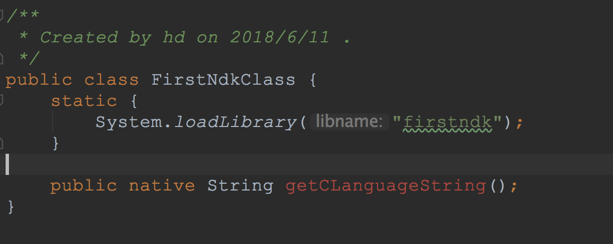
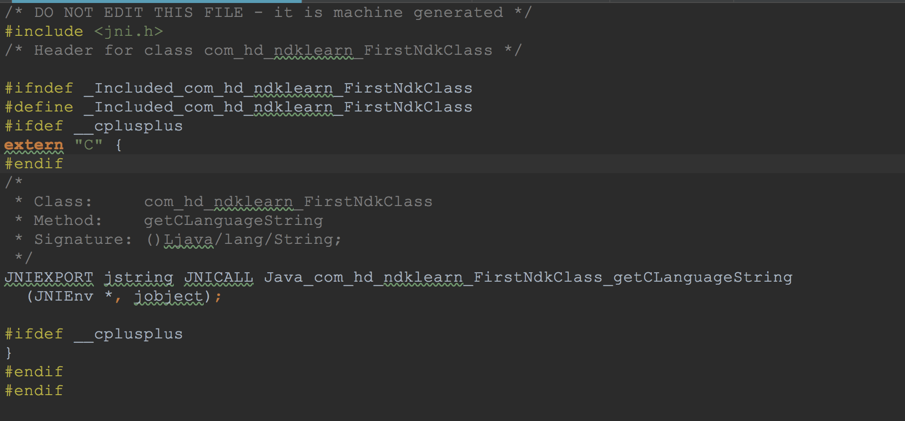
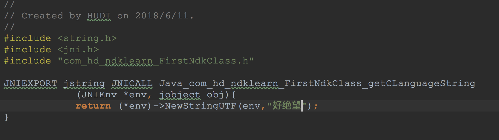

# 学习使用Android.mk编译第一个so库

## **流程**

### 1. 生成具有native声明的java类 FirstNdkClass ，然后Rebuild Project工程



### 2. 生成FirstNdkClass类的头文件

#### 2.1 在Terminal中输入如下指令，切换到FirstNdkClass目录

```
cd app/build/intermediates/classes/debug
```

#### 2.2 执行指令： javah -classpath . -jni 包路径

```
javah -classpath . -jni  com.hd.ndklearn.FirstNdkClass
```

#### 2.3 此时在 app/build/intermediates/classes/debug 下已经生成了 com_hd_ndklearn_FirstNdkClass.h文件,然后在main下新建jni文件夹，并把该.h文件复制过来



### 3. 生成FirstNdkClass类的.c文件, 在jni目录下新建jnitest.c文件



### 4. 到此头文件及内容文件都有了，如果此时Make Project会提示错误，解决如下

#### 4.1 在gradle.properties文件内追加如下，表示支持旧版本ndk

```
android.useDeprecatedNdk=true
```

#### 4.2 在app/build.gradle android节点内添加如下,表示不使用as工具自动生成的Android.mk 编译so

```
android {
 //...
 
 sourceSets {
     main {
         jni.srcDirs = []//disable automatic ndk-build call
     }
 }
 
 //...
}
```

#### 4.3 在4.2提到不需要原有的Android.mk，所以需要手动在main/jni下新建 Android.mk 及 Application.mk

### 5. 编译so文件，在Terminal中输入如下指令

#### 5.1 切换到main路径

```
cd app/src/main
```

#### 5.2 执行ndk-build指令生成so文件,如果指令执行失败，考虑ndk环境问题

```
ndk-build
```


## 附 MAC NDK 环境设置

### 打开终端执行如下指令,终端不关闭

```
open .bash_profile
```

### 在已打开.bash_profile的文件内输入并保存

```
export NDK_HOME=个人 android sdk 路径/ndk-bundle
export PATH=${PATH}:$NDK_HOME
```

### 终端执行如下指令更新,如指令执行失败，可以尝试打开.bash_profile并将其内容复制到其他地方并保存一个空文件，然后再次终端打开,复制还原并再次执行更新

```
source .bash_profile
```


## 问题点记录

### 1. 打包成的so一直无法使用,提示UnsatisfiedLinkError，后来发现使用指令生成头文件指向native地址不对，中间莫名其妙多了一个1

### 2. 打包成的so一直无法使用,提示UnsatisfiedLinkError，后来发现Android.mk LOCAL_SRC_FILES 属性指向的.c文件地址错误，原来使用的是决定地址后来发生变化没有改过来，实际上可以使用相对地址即直接使用文件名即可

### 3. jniLibs.srcDirs "src/main/libs" 可以不设置，但是需要新建jniLibs文件夹并把so文件拷贝过去


